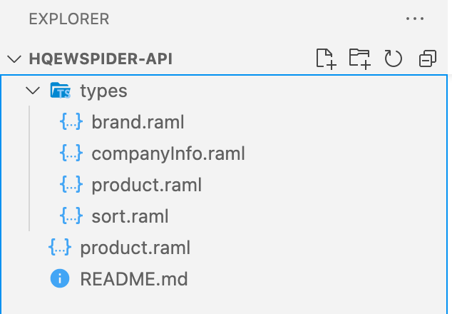
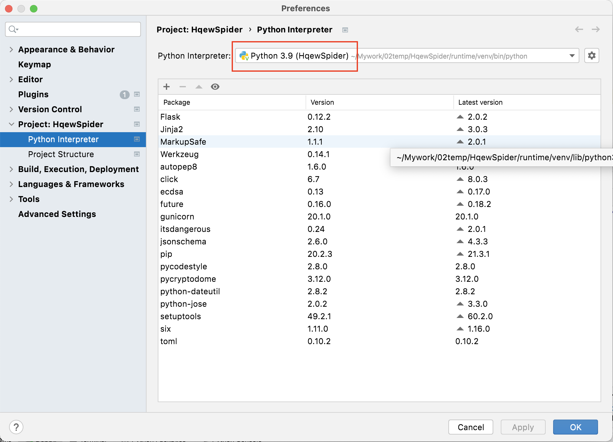

# Hot Raml 用户手册

hot-raml 当前最新版本 [0.9.0](https://gihub.com/hotmall/hot-raml/releases/v0.8.0)

## 搭建 hot-raml 开发环境

### hot-raml for Mac Arm64

1. 下载 [go](https://go.dev/dl/) 并解压到 `/usr/local` 目录下

    ```shell
    wget https://go.dev/dl/go1.16.12.darwin-arm64.tar.gz
    tar -C /usr/local -zxvf  go1.11.5.darwin-arm64.tar.gz
    ```

2. 下载并解压 hot-raml 工具到 `~/go/bin` 目录下

    ```shell
    wget https://dl.myhotmall.cn/dev/hot-raml-0.9.0.darwin.arm64.tgz
    tar -C ~/go/bin -zxvf hot-raml-0.9.0.darwin.arm64.tgz
    ```

3. 设置环境变量

    ```shell
    export PATH=~/go/bin:/usr/local/go/bin:$PATH
    export GOPROXY=https://goproxy.io,direct
    export GOPRIVATE=gitlab.com/hotmall,gitee.com/ichelp,gitlab.com/blueic
    ```

### hot-raml for Linux Amd64

1. 下载 [go](https://go.dev/dl/) 并解压到 `/usr/local` 目录下

    ```shell
    wget https://go.dev/dl/go1.16.12.linux-amd64.tar.gz
    sudo tar -C /usr/local -zxvf  go1.11.5.linux-amd64.tar.gz
    ```

2. 下载并解压 hot-raml 工具到 `~/go/bin` 目录下

    ```shell
    wget https://dl.myhotmall.cn/dev/hot-raml-0.9.0.linux.x86_64.tgz
    tar -C ~/go/bin -zxvf hot-raml-0.9.0.linux.x86_64.tgz
    ```

3. 设置环境变量

    ```shell
    export PATH=~/go/bin:/usr/local/go/bin:$PATH
    export GOPROXY=https://goproxy.io,direct
    export GOPRIVATE=gitlab.com/hotmall,gitee.com/ichelp,gitlab.com/blueic
    ```

### hot-raml for Windows Amd64

1. 下载 [go](https://go.dev/dl/) 并解压到 `c:\` 盘根目录下

2. 下载并解压 hot-raml 工具到 `~/go/bin` 目录下

    ```shell
    wget https://dl.myhotmall.cn/dev/hot-raml-0.9.0.10.mingw64_nt-10.0-19042.x86_64.tgz
    tar -C ~/go/bin -zxvf hot-raml-0.9.0.10.mingw64_nt-10.0-19042.x86_64.tgz
    ```

3. 设置环境变量

   ```bat
   set PATH=%HOME%\go\bin;c:\go\bin;%PATH%
   set GOPROXY=https://goproxy.io,direct
   set GOPRIVATE=gitlab.com/hotmall,gitee.com/ichelp,gitlab.com/blueic
   ```

## 服务开发 Quick Start

### 如何使用 Hot Raml 工具开发一个 Go 服务

1. 使用 raml 定义服务接口，并在 git 上建立一个独立的仓库存放，命名建议：服务名-Api，以服务 HqewSpider 为例(下同)，则 api 仓库为 HqewSpider-Api，git 仓库如下：

    ```shell
    https://gitee.com/ichelp/HqewSpider-Api.git
    ```

2. 在 git 上建立服务仓库, 以 HqewSpider 为例

    ```shell
    mkdir HqewSpider
    cd HqewSpider
    git init .
    ```

3. 在服务仓库中建立 api 子模块

    ```shell
    cd HqewSpider
    git submodule add https://gitee.com/ichelp/HqewSpider-Api.git api
    ```

4. 使用 hot 命令生成项目目录及工程脚本

    ```shell
    cd HqewSpider
    hot server -l go --kind gorestful --module HqewSpider
    ```

5. 生成 go 代码

    ```shell
    # 第一次生成，使用 sh generate.sh
    cd HqewSpider/code
    go generate

    # 第一次生成后，会生成一个 Makefile 文件，之后可以使用 make 命令生成
    make build
    ```

6. 编译打包, 在 HqewSpider/dist 目录中会生成以 .tgz(.tar.gz) 结尾打包文件

    ```shell
    cd HqewSpider/dist
    make zip
    ```

    **备注：go 场景 make build，会使用 go build 工具将 .go 代码编译成可执行文件，因此编译环境与运行时环境，go 的版本要保持一致**

### 如何使用 Hot Raml 工具开发一个 python 服务

1. 使用 raml 定义服务接口，并在 git 上建立一个独立的仓库存放，命名建议：服务名-Api，以服务 HqewSpider 为例(下同)，则 api 仓库为 HqewSpider-Api，git 仓库如下：

    ```shell
    https://gitee.com/ichelp/HqewSpider-Api.git
    ```

    

2. 在 git 上建立服务仓库, 以 HqewSpider 为例

    ```shell
    mkdir HqewSpider
    cd HqewSpider
    git init .
    ```

3. 在服务仓库中建立 api 子模块

    ```shell
    cd HqewSpider
    git submodule add https://gitee.com/ichelp/HqewSpider-Api.git api
    ```

4. 使用 hot 命令生成项目目录及工程脚本

    ```shell
    cd HqewSpider
    hot server -l python --kind flask --module HqewSpider
    ```

5. 创建 python 虚拟环境

    ```shell
    cd HqewSpider/runtime
    sh bin/setup.sh
    ```

6. 进入 python 虚拟环境

    `Windows`

    ```shell
    cd HqewSpider/runtime
    . venv/Scripts/activate
    ```

    `Mac/Linux`

    ```shell
    cd HqewSpider/runtime
    . venv/bin/activate
    ```

7. 在 python 虚拟环境下，执行 `sh generate.sh` 生成 python 代码

    ```shell
    # 第一次生成，使用 sh generate.sh
    cd HqewSpider/code
    sh generate.sh

    # 第一次生成后，会生成一个 Makefile 文件，之后可以使用 make 命令生成
    make build
    ```

8. 导入 python 项目依赖

    ```shell
    # 导入项目依赖
    cd HqewSpider/code
    pip install -r requirements.txt
    ```

9. 编译打包, 在 `HqewSpider/dist` 目录中会生成以 `.tgz(.tar.gz)` 结尾打包文件

    ```shell
    # 只编译不打包
    cd HqewSpider/code
    make build

    # 编译打包
    make zip

    # 查看打包结果
    ls HqewSpider/dist
    ```

10. 【这步在需要的时候再使用】退出 python 虚拟环境

    ```shell
    deactivate
    ```

    **备注：python 场景 make build，会使用 compileall 工具将 .py 脚本编译成 .pyc 文件，因此编译环境与运行时环境，python 的版本要保持一致**

## 调试

### 使用 visual studio code 调试 go 工程，launch.json 配置如下

```json
{
    // Use IntelliSense to learn about possible attributes.
    // Hover to view descriptions of existing attributes.
    // For more information, visit: https://go.microsoft.com/fwlink/?linkid=830387
    "version": "0.2.0",
    "configurations": [
        {
            "name": "Launch Package",
            "type": "go",
            "request": "launch",
            "mode": "auto",
            "program": "${workspaceFolder}/code",
            "args": [
                "-p", "${workspaceFolder}/runtime",
                "-port", "31948"
            ],
            "dlvLoadConfig": {
                "followPointers": true,
                "maxVariableRecurse": 1,
                "maxStringLen": 512,
                "maxArrayValues": 64,
                "maxStructFields": -1
            }
        }
    ]
}
```

### 使用 visual studio code 调试 python flask 工程，launch.json 配置如下

- Mac

```json
{
    // Use IntelliSense to learn about possible attributes.
    // Hover to view descriptions of existing attributes.
    // For more information, visit: https://go.microsoft.com/fwlink/?linkid=830387
    "version": "0.2.0",
    "configurations": [
        {
            "name": "Python: Flask",
            "type": "python",
            "request": "launch",
            "module": "flask",
            "pythonPath": "${workspaceFolder}/runtime/venv/bin/python",
            "cwd": "${workspaceFolder}/code",
            "env": {
                "FLASK_APP": "app:app",
                "FLASK_ENV": "development"
            },
            "args": [
                "run",
                "--no-debugger"
            ],
            "jinja": true
        }
    ]
}
```

- Windows

```json
{
    // Use IntelliSense to learn about possible attributes.
    // Hover to view descriptions of existing attributes.
    // For more information, visit: https://go.microsoft.com/fwlink/?linkid=830387
    "version": "0.2.0",
    "configurations": [
        {
            "name": "Python: Flask",
            "type": "python",
            "request": "launch",
            "module": "flask",
            "pythonPath": "${workspaceFolder}/runtime/venv/Scripts/python",
            "cwd": "${workspaceFolder}/code",
            "env": {
                "FLASK_APP": "app:app",
                "FLASK_ENV": "development"
            },
            "args": [
                "run",
                "--no-debugger"
            ],
            "jinja": true
        }
    ]
}
```

### 使用 pycharm 调试 python flask 工程

打开 pycharm 工程设置中，配置 python virtual env 就可以了，如下图：


如果 pycharm 启动调试时，报下面的错误，将 `code/__init__.py 删除`再启动调试

```shell
Traceback (most recent call last):
  File "/Applications/PyCharm CE.app/Contents/plugins/python-ce/helpers/pydev/_pydevd_bundle/pydevd_console_integration.py", line 4, in <module>
    from code import InteractiveConsole, InteractiveInterpreter
ImportError: cannot import name 'InteractiveConsole' from 'code' (/Users/j00234709/Mywork/02temp/HqewSpider/code/__init__.py)

During handling of the above exception, another exception occurred:

Traceback (most recent call last):
  File "/Applications/PyCharm CE.app/Contents/plugins/python-ce/helpers/pydev/pydevd.py", line 45, in <module>
    from _pydevd_bundle.pydevd_comm import CMD_SET_BREAK, CMD_SET_NEXT_STATEMENT, CMD_STEP_INTO, CMD_STEP_OVER, \
  File "/Applications/PyCharm CE.app/Contents/plugins/python-ce/helpers/pydev/_pydevd_bundle/pydevd_comm.py", line 91, in <module>
    from _pydevd_bundle import pydevd_console_integration
  File "/Applications/PyCharm CE.app/Contents/plugins/python-ce/helpers/pydev/_pydevd_bundle/pydevd_console_integration.py", line 6, in <module>
    from _pydevd_bundle.pydevconsole_code_for_ironpython import IronPythonInteractiveConsole as InteractiveConsole, \
  File "/Applications/PyCharm CE.app/Contents/plugins/python-ce/helpers/pydev/_pydevd_bundle/pydevconsole_code_for_ironpython.py", line 305
    exec code in self.locals
         ^
SyntaxError: Missing parentheses in call to 'exec'
```

## 附录

- [go 下载](https://go.dev/dl/)
- [cmder 下载](https://go.dev/dl/)
- [Make for Windows 下载](http://gnuwin32.sourceforge.net/packages/make.htm)
